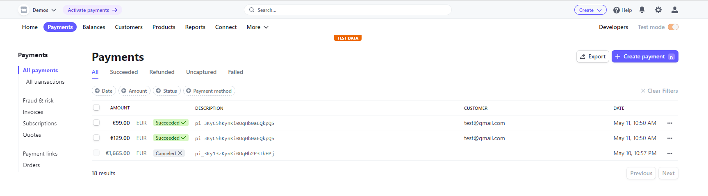

<h1 align="center">Booktec / BulkyBook Bookstore Application</h1>

<p align="center"></p>
Stripe Payments Screenshot
<p align="center"></p>

# Introduction

Booktec is Ecommerce Bookstore built in C# ASP.NET 6.

# About ASP.NET Core

Dot Net Core was built with cloud in mind, so it is extremely robust with that.

- Cross Platform
- Fast and Open Soruce
- Built in Dependency Injection
- Easy Upgradable Updates (less breaking changes)
- Cloud Friendly
- Performance

# Table of Contents

- [Introduction](#introduction)
- [About ASP.NET Core](#about-aspnet-core)
- [Table of Contents](#table-of-contents)
- [Features](#features)
- [Project Schema](#project-schema)
- [Tools Required](#tools-required)
- [Instructions](#instructions)
- [User Accounts, Role and Identity Management](#user-accounts-role-and-identity-management)
- [Demo Payments using Stripe](#demo-payments-using-stripe)

---

# Features

1.  N-Tier Architecture
2.  Repository Pattern and UnitOfWork
3.  TempData/ViewBag/ViewData in .NET core
4.  API Controllers with Razor Pages
5.  Sweet Alerts, Rich Text Editor and DataTables with .NET Core
6.  Authentication and Authorization
    1. Scaffold Identity (Razor Class Libary)
7.  Roles and Authorization in .NET Core
8.  Stripe Payment/Refund with .NET Core
9.  SendGrid Auto Emails
10. Session in .NET Core
11. Emails with SMTP and SendGrid
12. Social Login using Facebook
13. View Components in .NET Core
14. Seed Database with Dbinitializer

# Project Schema

```py
<BulkyBook>
├── BulkyBook.DataAccess                                         # Data Access Layer
|   ├── Data
|   │   └── ApplicationDbContext.cs
|   ├── DbInitializer                     # Database Initializer
|   |   ├── DbInitializer.cs
|   │   └── IDbInitializer.cs
|   ├── Repository
|   │   ├── IRepository                   # Interfaces
|   │   │   ├── IApplicationRepository.cs
|   │   │   ├── ICategoryRepository.cs
|   │   │   ├── ICompanyRepository.cs
|   │   │   ├── ICoverTypeRepository.cs
|   │   │   ├── IOrderDetailRepository.cs
|   │   │   ├── IOrderHeaderRepository.cs
|   │   │   ├── IProductRepository.cs
|   │   │   ├── IRepository.cs
|   │   │   ├── IShoppingCartRepository.cs
|   │   │   └── IUnitOfWork.cs
|   │   ├── ApplicationUserRepository.cs
|   │   ├── CategoryRepository.cs
|   │   ├── CompanyRepository.cs
|   │   ├── CoverTypeRepository.cs
|   │   ├── OrderDetailRepository.cs
|   │   ├── OrderHeaderRepository.cs
|   │   ├── ProductRepository.cs
|   │   ├── Repository.cs
|   │   ├── ShoppingCartRepository.cs
|   │   └── UnitOfWork.cs
|   └── dependencies
|       └── ...
├── BulkyBook.DataModels                                                  # Models
|   │   ├── ViewModels
|   │   │   ├── OrderVM.cs
|   │   │   ├── ProductVM.cs
|   │   │   └── ShoppingCartVM.cs
|   │   ├── ApplicationUser.cs
|   │   ├── Category.cs
|   │   ├── Company.cs
|   │   ├── CoverType.cs
|   │   ├── ErrorViewModel.cs
|   │   ├── OrderDetail.cs
|   │   ├── OrderHeader.cs
|   │   └── Product.cs
|   └── dependencies
|       └── ...
├── BulkyBook.Utility                       # Utility
|   │   ├── EmailSender.cs
|   │   ├── SD.cs
|   │   └── StripeSettings.cs
|   └── dependencies
|       └── ...
├── BulkyBook.Utility                                                   # Frontend
|   ├── Connected Services
|   │   └── ...
|   ├── Dependencies
|   │   ├── Analyzers
|   |   |   └── ...
|   │   └── Frameworks
|   |       ├── Microsoft.AspNetCore.App
|   |       └── Microsoft.NETCore.App
|   ├── Properties
|   │   └── launchSettings.json
|   ├── wwwroot
|   │   ├── css
|   │   │   ├── bootswatchTheme.css
|   │   │   └── site.css
|   │   ├── images
|   │   │   ├── products
|   │   │   |   └── ...
|   │   │   └── lawn_leaf.jpg
|   │   ├── js
|   │   │   ├── company.js
|   │   │   ├── order.js
|   │   │   ├── product.js
|   │   │   └── site.js
|   │   ├── lib
|   │   │   ├── jquery
|   |   |   |   ├── dist
|   |   |   |   |   └── jquery.js
|   |   |   |   |      └── jquery.min.js
|   │   │   |   └── LICENSE.txt
|   │   │   ├── jquery-validation
|   |   |   |   ├── dist
|   |   |   |   |   ├── additional-methods.js
|   |   |   |   |   |   └── additional-methods.min.js
|   |   |   |   |   └── jquery.validate.js
|   |   |   |   |       └── jquery.validate.min.js
|   │   │   |   └── LICENSE.md
|   │   │   └── jquery-validation-unobtrusive
|   |   │       ├── jquery.validate.unobtrusive.js
|   │   │       └── LICENSE.txt
|   │   └── favicon.ico
|   ├── Areas
|   │   ├── Admin
|   │   │   ├── Controllers
|   |   |   |   ├── CategoryController.cs
|   |   |   |   ├── CompanyController.cs
|   |   |   |   ├── CoverTypeController.cs
|   |   |   |   ├── OrderController.cs
|   |   |   |   └── ProductController.cs
|   │   │   └──  Views
|   |   |        ├── Category
|   |   |        |   ├── Create.cshtml
|   |   |        |   ├── Delete.cshtml
|   |   |        |   ├── Edit.cshtml
|   |   |        |   └── Index.cshtml
|   |   |        ├── Company
|   |   |        |   ├── Index.cshtml
|   |   |        |   └── Upsert.cshtml
|   |   |        ├── CoverType
|   |   |        |   ├── Create.cshtml
|   |   |        |   ├── Delete.cshtml
|   |   |        |   ├── Edit.cshtml
|   |   |        |   └── Index.cshtml
|   |   |        ├── Order
|   |   |        |   ├── Details.cshtml
|   |   |        |   ├── Index.cshtml
|   |   |        |   └── PaymentConfirmation.cshtml
|   |   |        ├── Product
|   |   |        |   ├── Index.cshtml
|   |   |        |   └── Upsert.cshtml
|   |   |        ├── _ViewImports.cshtml
|   |   |        └── _ViewStart.cshtml
|   │   └── Customer
|   │      ├── Controllers
|   |      |   └── dist
|   |      |      ├── css
|   |      |      |   ├── bootstrap.css
|   |      |      |   ├── bootstrap-grid-css
|   |      |      |   ├── bootstrap-reboot.css
|   |      |      |   └── bootstrap-utilities.css
|   |      |      └── js
|   |      |          └── bootstrap.js
|   |      |              ├── bootstrap.bundle.js
|   |      |              ├── bootstrap.esm.js
|   |      |              ├── bootstrap.js.map
|   |      |              └── bootstrap.min.js
|   │      ├── Views
|   |      |   └── dist
|   |      |      ├── css
|   |      |      |   ├── bootstrap.css
|   |      |      |   ├── bootstrap-grid-css
|   |      |      |   ├── bootstrap-reboot.css
|   |      |      |   └── bootstrap-utilities.css
|   |      |      └── js
|   |      |          └── bootstrap.js
|   |      |              ├── bootstrap.bundle.js
|   |      |              ├── bootstrap.esm.js
|   |      |              ├── bootstrap.js.map
|   |      |              └── bootstrap.min.js
|   │      └── Identity
|   |          ├── Pages
|   |          |   └── Account
|   |          |        ├── Manage
|   |          |        |   ├── _Layout.cshtml
|   |          |        |   ├── _ManageNav.cshtml
|   |          |        |   ├── _StatusMessage.cshtml
|   |          |        |   ├── _ViewImports.cshtml
|   |          |        |   ├── ChangePassword.cshtml
|   |          |        |   ├── DeletePersonalData.cshtml
|   |          |        |   ├── Disable2fa.cshtml
|   |          |        |   ├── DownloadPersonalData.cshtml
|   |          |        |   ├── Email.cshtml
|   |          |        |   ├── EnableAuthenticator.cshtml
|   |          |        |   ├── ExternalLogins.cshtml
|   |          |        |   ├── GenerateRecoveryCodes.cshtml
|   |          |        |   ├── Index.cshtml
|   |          |        |   ├── ManageNavPages.cs
|   |          |        |   ├── PersonalData.cshtml
|   |          |        |   ├── ResetAuthenticator.cshtml
|   |          |        |   ├── SetPassword.cshtml
|   |          |        |   ├── ShowRecoveryCodes.cshtml
|   |          |        |   └── TwoFactorAuthentication.cshtml
|   |          |        ├── _StatusMessage.cshtml
|   |          |        ├── _ViewImports.cshtml
|   |          |        ├── AccessDenied.cshtml
|   |          |        ├── ConfirmEmail.cshtml
|   |          |        ├── ConfirmEmailChange.cshtml
|   |          |        ├── ExternalLogin.cshtml
|   |          |        ├── ForgotPassword.cshtml
|   |          |        ├── ForgetPasswordConfirmation.cshtml
|   |          |        ├── Logout.cshtml
|   |          |        ├── Login.cshtml
|   |          |        ├── LoginWith2fa.cshtml
|   |          |        ├── LoginWithRecoveryCode.cshtml
|   |          |        ├── Logout.cshtml
|   |          |        ├── Register.cshtml
|   |          |        ├── RegisterConfirmation.cshtml
|   |          |        ├── RegisterConfirmation.cshtml
|   |          |        ├── ResendEmailConfirmation.cshtml
|   |          |        ├── ResetPassword.cshtml
|   |          |        └── ResetPasswordConfirmation.cshtml
|   |          ├── _ValidationScriptsPartial.cshtml
|   |          ├── _ViewImports.cshtml
|   |          ├── _ViewStart.cshtml
|   │          └── Error.cshtml
|   ├── ViewComponents
|   │   └── ShoppingCartViewComponent.cs
|   ├── Views
|   │   ├── Shared
|   |   |   ├── Components
|   |   |   |   └── ShoppingCart
|   |   |   |       └── Default.cshtml
|   │   │   ├── _Layout.cshtml
|   │   │   ├── _LoginPartial.cshtml
|   │   │   ├── _Notification.cshtml
|   │   │   ├── _ValidationScriptsPartial.cshtml
|   │   │   └── Error.cshtml
|   │   ├── _ViewImports.cshtml
|   │   └── _ViewStart.cshtml
|   ├── appsettings.json
|   │   └── appsettings.Development.json
|   └── Program.cs
```

# Tools Required

Tools Required

- [x] .NET 6
- [x] Visual Studio 2022
- [x] SSMS (SQL Server Management Studio 2018>)

# Instructions

To run on your local pc:

- Clone Repo
- Open the solution in Visual Studio
- Create SendGrid and Stripe Accounts and populate the credentials within `BulkyBook.Utility`
- Use Microsoft SQL Server Management Server to create a MS SQL Database on your local pc
  - Use this tool to access the database on the local pc
  - Populate the db connection string within `appsettings.json` including all other connection strings such as Stripe and SendGrid.
  - Run the following command in the Nuget Package Manager terminal to push migrations and seed the MS SQL database:
    - `update database`
  - Use Admin User account details below to get started and populate data in the database.
  - Run the application in Cisual Studio

# User Accounts, Role and Identity Management

| Account Type    | Email                  | Password        |
| --------------- | ---------------------- | --------------- |
| Admin User      | admin@booktec.com      | Admin123\*      |
| Employee User   | employee@booktec.com   | Employee123\*   |
| Individual User | individual@booktec.com | Individual123\* |
| Company User    | company@booktec.com    | Company123\*    |

# Demo Payments using Stripe

In order to place order you can use any test credit card number supported by stripe.

- Sample Stripe Details are as follows:
  - Card Number: `4242 4242 4242 4242`
  - Valid date: Any 3 digit CVV.
